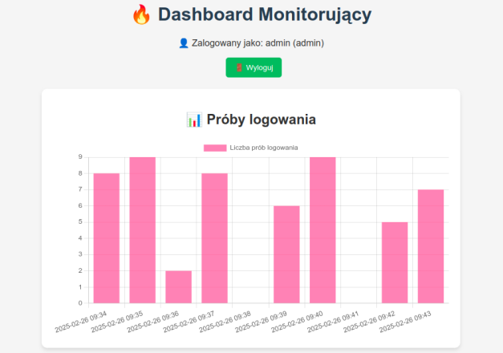
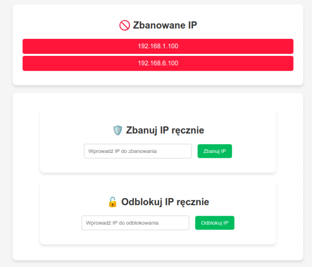
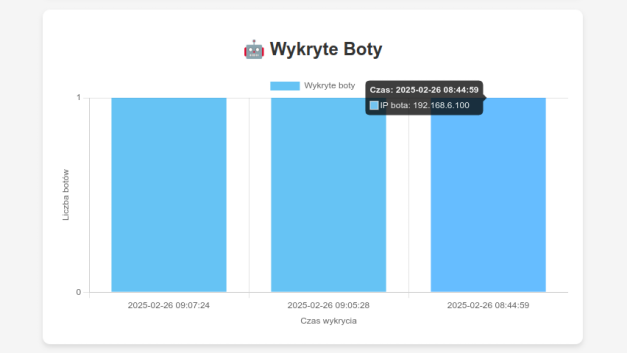
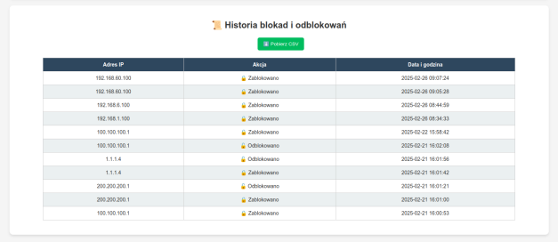

# BruteForce Monitor

**BruteForce Monitor** to aplikacja monitorująca próby logowania i wykrywająca podejrzane zachowania, takie jak boty próbujące przeprowadzić ataki brute-force. Wykorzystuje analizę czasów między naciśnięciami klawiszy oraz historię logowań, aby identyfikować podejrzane IP i blokować je automatycznie.

## Funkcjonalności
- Monitorowanie prób logowania i ich wizualizacja na wykresach
- Wykrywanie botów na podstawie analizy czasów naciśnięć klawiszy
- Automatyczne blokowanie podejrzanych IP
- Możliwość ręcznego zarządzania IP
- System autoryzacji JWT dla dostępu do panelu administracyjnego
- Interaktywny dashboard, możliwość pobrania historii blokad do pliku csv

## Screenshots









## Technologie
- Backend: Python, Flask
- Frontend: HTML, JavaScript, Chart.js
- Baza danych/logi: JSON, pliki logów
- Bezpieczeństwo: JWT (JSON Web Token), iptables

## Instalacja i uruchomienie
1. Klonowanie repozytorium
```
git clone https://github.com/mh00909/bruteforce-monitor.git
cd bruteforce-monitor
```
2. Instalacja zależności
```
pip install -r requirements.txt
```
3. Uruchomienie aplikacji
```
python app.py
```
## Użytkownicy i role
Aplikacja posiada system autoryzacji oparty na JWT. Przykładowe dane logowania:

| Login |	Hasło	| Rola|
|--|--|--|
|admin	|adminpass	|Administrator|
|user	|userpass	|Użytkownik|

## Blokowanie IP i wykrywanie botów
#### Wykrywanie botów
Aplikacja analizuje czas między naciśnięciami klawiszy:
- Jeśli odchylenie standardowe czasów < 0.05s, użytkownik zostaje uznany za bota.
- W przypadku bota jego IP jest automatycznie blokowane.
#### Blokowanie IP
Można zablokować IP na dwa sposoby:
- Automatycznie – po wykryciu bota.
- Ręcznie – poprzez panel administratora w dashboardzie.

Aby sprawdzić zablokowane IP:
```
sudo iptables -L INPUT -v -n
```